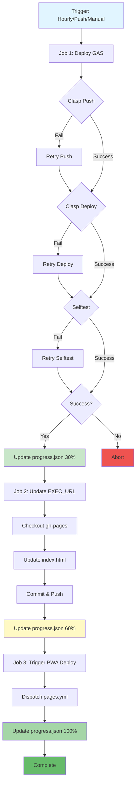

# יומן חכם – Google Calendar PWA

A Progressive Web App for managing Google Calendar with Hebrew natural language processing.

## 🚀 Autonomous Deployment System

This repository features a fully autonomous, self-healing deployment system that automatically deploys and synchronizes the Google Apps Script backend with the PWA frontend.

### Architecture Overview

The deployment system consists of three interconnected workflows:

1. **GAS Deployment** (`gas-deploy.yml`) - Deploys the Google Apps Script backend
2. **EXEC_URL Update** (`set-exec-url.yml`) - Updates the frontend with the new backend URL
3. **PWA Deployment** (`pages.yml`) - Deploys the PWA to GitHub Pages



### Autonomous Features

#### 🔄 Self-Healing Deployments
- Runs automatically every hour via cron schedule (`0 * * * *`)
- Automatically retries failed operations (push, deploy, selftest)
- Continues deployment chain only on successful steps
- Can be customized by editing the cron expression in `gas-deploy.yml`

**Cron Schedule Examples**:
- Every hour: `0 * * * *` (current setting)
- Every 6 hours: `0 */6 * * *`
- Every day at midnight: `0 0 * * *`
- Every Monday at 9 AM: `0 9 * * 1`

#### 📊 Progress Tracking
The system maintains a `progress.json` file that tracks deployment progress:
- **30%** - GAS deployment complete
- **60%** - EXEC_URL updated in gh-pages
- **100%** - PWA deployment triggered

#### 🔗 Job Chaining
The workflows are chained to execute in sequence:
```
GAS Deploy (30%)
    ↓
Update EXEC_URL (60%)
    ↓
Trigger PWA Deploy (100%)
```

### Triggers

#### Automatic Triggers
- **Hourly Schedule**: Runs every hour for self-healing
- **Push to Main**: Triggered on any push to the main branch

#### Manual Triggers
- **Workflow Dispatch**: Can be triggered manually from GitHub Actions
- **Issue Commands**: Set EXEC_URL via GitHub issues (legacy support)

### Workflow Details

#### 1. GAS Deployment Workflow

**File**: `.github/workflows/gas-deploy.yml`

**Jobs**:
- `deploy`: Deploys Google Apps Script and runs selftest
- `update-exec-url`: Updates the EXEC_URL in gh-pages
- `trigger-pwa-deploy`: Triggers the PWA deployment

**Error Handling**:
- Retries clasp push on failure
- Retries clasp deploy on failure
- Retries selftest with 10-second delay

**Progress Updates**:
- Updates `progress.json` after each major step
- Commits progress to main branch

#### 2. EXEC_URL Update Workflow

**File**: `.github/workflows/set-exec-url.yml`

**Supports Two Modes**:
1. **Automated**: Called by gas-deploy workflow via `workflow_call`
2. **Manual**: Triggered by GitHub issues with "Set EXEC_URL" in the title

**Features**:
- Parses EXEC_URL from workflow input or issue body
- Updates `index.html` in gh-pages branch
- Updates iframe src, const EXEC_URL, and window.EXEC_URL patterns

#### 3. PWA Deployment Workflow

**File**: `.github/workflows/pages.yml`

**Triggers**:
- Push to main branch
- Workflow dispatch (manual)
- Workflow call (from gas-deploy)

### Progress Tracking Format

```json
{
  "lastUpdate": "2025-01-15T12:00:00Z",
  "currentStep": "gas_deploy",
  "percent": 30,
  "steps": {
    "gas_deploy": {
      "status": "completed",
      "percent": 30,
      "lastRun": "2025-01-15T12:00:00Z",
      "execUrl": "https://script.google.com/..."
    },
    "exec_url_update": {
      "status": "in_progress",
      "percent": 60,
      "lastRun": ""
    },
    "pwa_deploy": {
      "status": "pending",
      "percent": 100,
      "lastRun": ""
    }
  },
  "history": []
}
```

### Setup Requirements

#### Secrets
Configure these secrets in your GitHub repository:
- `CLASP_TOKEN_JSON`: Google Apps Script authentication token
- `GAS_SCRIPT_ID`: Your Google Apps Script project ID

#### Permissions
The workflows require these permissions:
- `contents: write` - To update files and branches
- `actions: write` - To trigger other workflows
- `issues: write` - To comment on issues
- `pages: write` - To deploy to GitHub Pages
- `id-token: write` - For GitHub Pages deployment

### Monitoring

#### Check Deployment Status

**Quick Check Script** (Recommended):
```bash
./scripts/check-deployment.sh
```

**Manual Checks**:
1. View the `progress.json` file in the main branch
2. Check GitHub Actions runs for detailed logs
3. Visit the GitHub Pages site to verify the PWA is updated

**View Progress JSON**:
```bash
curl https://raw.githubusercontent.com/yanivmizrachiy/gcal_pwa_yaniv/main/progress.json | jq
```

#### Common Issues

**Selftest Fails**
- The system automatically retries after 10 seconds
- Check that the EXEC_URL is correct
- Verify the Google Apps Script is deployed correctly

**EXEC_URL Not Updated**
- Check that the gh-pages branch exists
- Verify the update-exec-url job completed successfully
- Check the Node.js script output for errors

**PWA Not Updating**
- Verify the pages.yml workflow was triggered
- Check GitHub Pages settings in repository settings
- Clear browser cache and service worker

**Progress.json Not Updating**
- Check that the workflow has `contents: write` permission
- Verify git config is set correctly in the workflow
- Check for merge conflicts in progress.json

**Workflow Not Triggering on Schedule**
- Verify the repository is active (GitHub disables scheduled workflows after 60 days of no activity)
- Check the Actions tab for any disabled workflows
- Manually trigger the workflow to re-enable it

**Retry Logic Not Working**
- Check the step IDs match in the workflow
- Verify `continue-on-error: true` is set for the initial attempt
- Check the `if` condition uses the correct outcome value

### Development

#### Local Testing
```bash
# Install dependencies
npm install -g @google/clasp

# Login to clasp
clasp login

# Push to Apps Script
clasp push
```

#### Manual Deployment
You can trigger deployments manually from the GitHub Actions tab:
1. Go to Actions → GAS Deployment
2. Click "Run workflow"
3. Select the branch and click "Run workflow"

## 📱 Features

### Natural Language Processing
The app supports Hebrew natural language commands:
- Create events: "פגישה עם דני מחר בשעה 10:00"
- Update events
- Delete events
- Search events

### PWA Capabilities
- Offline support via service worker
- Install to home screen
- Responsive design
- Dark theme

## 🏗️ Architecture

### Backend
- **Google Apps Script** (`src/Code.gs`)
- Handles calendar operations
- Hebrew NLP processing
- RESTful API (doPost/doGet)

### Frontend
- **Minimal PWA** (`index.html`, `sw.js`)
- Iframe embedding the GAS web app
- Service worker for offline support
- Manifest for installation

### Deployment
- **GitHub Actions** - CI/CD automation
- **GitHub Pages** - PWA hosting
- **Google Apps Script** - Backend hosting

## 🛠️ Utility Scripts

### Check Deployment Status
```bash
./scripts/check-deployment.sh
```

This script provides a comprehensive overview of:
- Current deployment progress
- Recent workflow runs
- Health status of GAS backend and PWA frontend
- EXEC_URL information

**Requirements**: `curl`, `jq` (optional), `gh` (optional)

## 📄 License

MIT License

## 🤝 Contributing

Contributions are welcome! The autonomous deployment system will automatically deploy your changes when merged to main.
