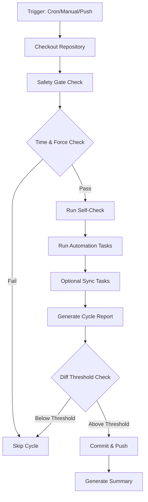

# Autonomous Operations Cycle

## Overview

This document describes the autonomous progress cycle implementation for the gcal_pwa_yaniv repository, aligned with the "Full-Scale Autonomy Protocol" directive while respecting GitHub Actions constraints.

## Architecture

### Core Components

1. **GitHub Actions Workflow** (`.github/workflows/auto-progress.yml`)
   - Scheduled hourly execution via cron
   - Manual trigger via `workflow_dispatch`
   - Selective push triggers for automation scripts
   - Concurrency control to prevent overlapping cycles

2. **Self-Check Module** (`scripts/self_check.js`)
   - Node.js diagnostic script
   - Generates health telemetry
   - Produces structured JSON output
   - Monitors repository state and system information

3. **Automation Tasks** (`scripts/auto_task.sh`)
   - Core automation logic (Bash)
   - Generates structural manifests
   - Updates meta status JSON
   - Placeholder modules for future expansion

4. **Sync Module** (`scripts/auto_sync.ps1`)
   - PowerShell cross-environment script
   - Identifies latest reports
   - Placeholder for webhook/n8n integrations
   - Future external service sync

### Data Structure

```
.autonomy/
├── reports/          # Cycle execution reports (Markdown)
├── cache/            # Manifests and formatted artifacts
├── meta/             # Status JSON and sync metadata
└── diagnostics/      # Self-check telemetry
```

## Design Principles

### 1. Self-Monitoring

The system continuously monitors its own health through:
- Repository state tracking (branch, commit, changes)
- System information capture (Node version, platform)
- Project metrics (file counts, structure analysis)
- Health indicators and scoring

**Output**: `.autonomy/diagnostics/self_check.json`

### 2. Controlled Autonomy

No perpetual processes - only event/schedule driven:
- **Hourly cron**: `0 * * * *` (on the hour)
- **Manual trigger**: `workflow_dispatch` with force option
- **Code changes**: Selective push to `main` for automation scripts
- **Concurrency**: Single cycle at a time (no overlaps)

### 3. Safety Gates

Multiple safety mechanisms prevent commit spam:

#### Time-Based Gate
- Minimum 60 minutes between auto-commits (configurable)
- Checks git log for last `[auto-cycle]` commit
- Can be overridden with `force_run` input

#### Diff-Based Gate
- Minimum 5 lines changed to trigger commit (configurable)
- Prevents noise from insignificant changes
- Only commits when meaningful work is done

#### Configuration
Environment variables in workflow:
```yaml
MIN_MINUTES_BETWEEN_COMMITS: 60
MIN_DIFF_LINES: 5
AUTO_COMMIT_ENABLED: true
```

### 4. Transparency

Every cycle produces clear, traceable artifacts:
- **Cycle Reports**: Timestamped Markdown files with full context
- **Commit Tags**: `[auto-cycle]` prefix for easy filtering
- **GitHub Summary**: Rich output in Actions run summary
- **Structured Logs**: JSON telemetry for programmatic access

### 5. Extensibility

Clear placeholder architecture for future enhancements:
- Performance profiling modules
- Dependency audit integrations
- Refactoring opportunity detection
- Security scanning (CodeQL, Trivy)
- External sync (webhooks, n8n, cloud storage)

## Workflow Execution Flow



## Safety Controls

### Preventing Infinite Loops
- No self-triggering: Push events only watch specific paths
- Concurrency group prevents simultaneous runs
- Timeout: 15-minute maximum execution time
- Exit early strategy when gates fail

### Rate Limiting
- Minimum 60-minute window between commits
- Prevents spam even if workflow triggers frequently
- Configurable thresholds via environment variables

### Manual Override
- `force_run` input parameter bypasses safety gates
- Useful for testing or urgent maintenance
- Requires manual workflow dispatch

## Generated Artifacts

### Runtime (Not Committed Upfront)

1. **Cycle Reports** (`.autonomy/reports/cycle_TIMESTAMP.md`)
   - Execution timestamp and run ID
   - Trigger type and branch information
   - Diagnostics and status JSON snapshots
   - Repository state summary
   - Changes summary

2. **Diagnostics** (`.autonomy/diagnostics/self_check.json`)
   ```json
   {
     "timestamp": "2024-01-01T12:00:00Z",
     "system": { "nodeVersion": "v20.x", ... },
     "repository": { "branch": "main", ... },
     "metrics": { "totalFiles": 100, ... },
     "health": { "status": "healthy", "healthScore": 95 }
   }
   ```

3. **Status** (`.autonomy/meta/STATUS.json`)
   ```json
   {
     "timestamp": "2024-01-01T12:00:00Z",
     "cycle": { "status": "completed", ... },
     "repository": { "branch": "main", ... },
     "modules": { "performance": "placeholder", ... }
   }
   ```

4. **Manifest** (`.autonomy/cache/manifest.json`)
   - Repository structure snapshot
   - File and directory counts
   - Git-tracked file statistics

## Future Enhancements

### Security & Quality (High Priority)

1. **CodeQL Integration**
   - Automated security scanning
   - Vulnerability detection
   - SARIF report generation

2. **Trivy Scanning**
   - Container and dependency scanning
   - License compliance checking
   - CVE detection

3. **Linting & Autofix**
   - ESLint for JavaScript
   - Prettier for formatting
   - Non-destructive patch suggestions

### Performance & Metrics

1. **Bundle Size Tracking**
   - Historical size trends
   - Size budget enforcement
   - Compression analysis

2. **Load Time Metrics**
   - Lighthouse CI integration
   - Core Web Vitals tracking
   - Performance regression detection

3. **Baseline Metrics**
   - Establish performance baselines
   - Trend analysis over time
   - Alert on regressions

### External Integration

1. **Webhook Integration**
   - POST cycle reports to external endpoints
   - n8n workflow triggers
   - Custom notification systems

2. **Cloud Storage Backup**
   - S3/Azure Blob for reports
   - Long-term historical data
   - Compliance archival

3. **Dashboard Integration**
   - Real-time status updates
   - Historical trend visualization
   - Team visibility portal

4. **Notification Channels**
   - Slack integration
   - Discord webhooks
   - Email summaries

### Analytics & Insights

1. **Aggregated Timeline**
   - Rolling window of last N reports
   - JSON timeline for programmatic access
   - Trend analytics

2. **Anomaly Detection**
   - Unusual change patterns
   - Health score degradation
   - Performance regressions

3. **Predictive Maintenance**
   - Dependency update forecasting
   - Technical debt trending
   - Resource utilization prediction

## Usage

### Manual Trigger

Navigate to Actions → Autonomous Progress Cycle → Run workflow

Options:
- **force_run**: Bypass safety gates (use sparingly)

### Monitoring

Check the following locations:
- **Actions Tab**: Real-time execution logs
- **Cycle Reports**: `.autonomy/reports/` directory
- **Status**: `.autonomy/meta/STATUS.json`
- **Diagnostics**: `.autonomy/diagnostics/self_check.json`

### Debugging

If a cycle fails:
1. Check the Actions run summary
2. Review cycle report (if generated)
3. Inspect self-check diagnostics
4. Check git log for `[auto-cycle]` commits

### Configuration

Adjust safety thresholds in `.github/workflows/auto-progress.yml`:
```yaml
env:
  MIN_MINUTES_BETWEEN_COMMITS: 60  # Minutes
  MIN_DIFF_LINES: 5                # Lines changed
  AUTO_COMMIT_ENABLED: true        # Enable/disable commits
```

## Security & Integrity

### Data Protection
- No embedded secrets in scripts
- Sensitive data via GitHub encrypted secrets
- No external data exfiltration
- Only repository structural metadata captured

### Commit Traceability
- All auto-commits tagged with `[auto-cycle]`
- Structured commit messages with timestamps
- Full audit trail in git history

### Permission Model
Minimal required permissions:
- `contents: write` - For committing cycle reports
- `issues: write` - Reserved for future extensions

### Future Secret Management
When integrating external services:
- Use GitHub Secrets for API keys
- Environment-specific configuration
- Secret rotation policies

## Maintenance

### Regular Tasks
- Review cycle reports weekly
- Monitor health scores
- Adjust safety thresholds as needed
- Archive old reports (>90 days)

### Updates
When modifying automation scripts:
- Test locally before committing
- Use `workflow_dispatch` with `force_run` for testing
- Monitor first few automated cycles after changes

### Troubleshooting
- If cycles stop running: Check cron schedule in workflow
- If commits are noisy: Increase `MIN_DIFF_LINES`
- If too few commits: Decrease `MIN_MINUTES_BETWEEN_COMMITS`
- If health degrades: Review diagnostics JSON

## Roadmap

### Phase 1: Foundation (Current)
- [x] Core workflow implementation
- [x] Self-check diagnostics
- [x] Automation task framework
- [x] Safety gates
- [x] Documentation

### Phase 2: Quality & Security (Next)
- [ ] CodeQL integration
- [ ] Linting pipeline
- [ ] Dependency audit automation
- [ ] Performance baseline

### Phase 3: Integration (Future)
- [ ] Webhook/n8n integration
- [ ] Cloud storage sync
- [ ] Notification channels
- [ ] Dashboard development

### Phase 4: Intelligence (Long-term)
- [ ] Anomaly detection
- [ ] Predictive maintenance
- [ ] AI-assisted refactoring
- [ ] Automated optimization

## Contributing

When extending the autonomous cycle:
1. Add new modules as separate scripts in `scripts/`
2. Update workflow to call new modules
3. Document in this file
4. Test with `workflow_dispatch` first
5. Monitor several automated cycles

## License & Attribution

Part of the gcal_pwa_yaniv project.
Autonomous cycle implementation follows GitHub Actions best practices.

---

*Last Updated: 2024*
*Version: 1.0.0*
